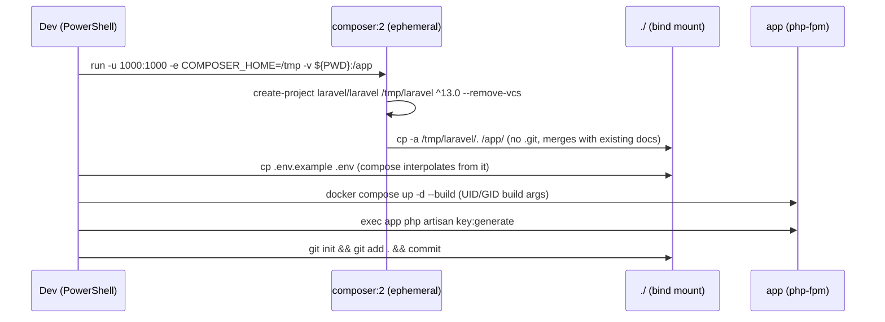
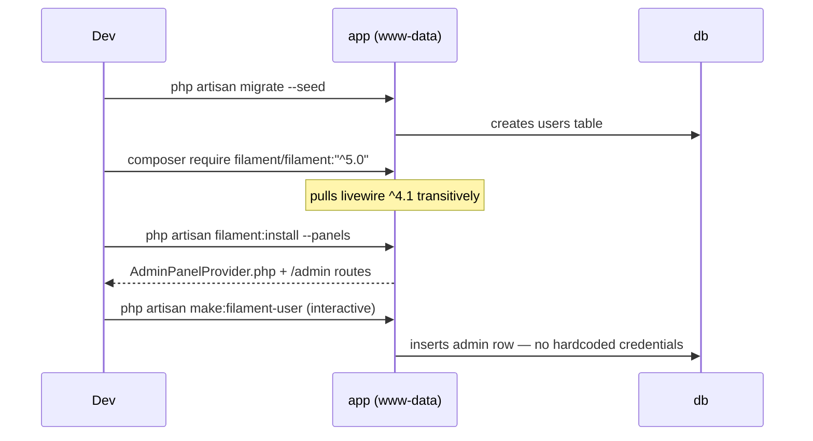

# Design: Fase 1 — Andamiaje (Docker + Laravel 13 + Filament v5)

## Technical Approach

Four-service Docker stack (`app`/`web`/`db`/`node`) over a single bind mount of the repo root at `/var/www/html`. Laravel is scaffolded **once** by an ephemeral `composer:2` container (proposal Approach 1); `docker/php/Dockerfile` stays a pure PHP-FPM runtime image and never generates code. Layering is unchanged from `ARQUITECTURA.md` §5 — this change adds only the environment shell plus the Filament panel; no domain code, no Services layer entries (Fase 2+).

## Architecture Decisions

### Decision: Scaffold into a container-local temp dir, then copy into the mount

**Choice**: `composer create-project laravel/laravel /tmp/laravel "^13.0" --no-interaction --remove-vcs` inside the container, then `cp -a /tmp/laravel/. /app/`.
**Alternatives considered**: `create-project ... .` writing directly into `/app` (the literal command in the proposal); pre-emptying the repo.
**Rationale**: Composer 2 aborts with *"Project directory is not empty"* when the target contains files — and this repo already holds `ARQUITECTURA.md`, `.atl/`, `openspec/`. The direct form **would fail**. Installing to `/tmp` also keeps `vendor/` resolution off the slow NTFS 9p mount, and `--remove-vcs` guarantees no nested `.git` is ever copied in.

### Decision: UID/GID pinned at 1000 across scaffold container and `app`

**Choice**: `Dockerfile` takes `ARG UID/GID` (default 1000), remaps `www-data` to them, ends with `USER www-data`. The scaffold container runs `-u 1000:1000 -e COMPOSER_HOME=/tmp`.
**Alternatives considered**: root everywhere + post-hoc `chown`; named volumes for `storage/`.
**Rationale**: This is the highest-likelihood failure mode. `USER www-data` makes `docker compose exec app php artisan …` run as the *same* identity as the FPM workers, so cached/log/compiled files never end up root-owned. PHP-FPM listens on 9000 (>1024), so a non-root master is safe. A one-time `chown` is kept as a belt-and-braces step, not the primary mechanism. `COMPOSER_HOME=/tmp` is required because uid 1000 cannot write the image's default `/composer` home.

### Decision: `.gitattributes` comes from the Laravel skeleton; `git init` runs **after** scaffold

**Choice**: scaffold → verify `.gitattributes` contains `* text=auto eol=lf` → extend `.gitignore` → `git init` → first commit.
**Alternatives considered**: `git init` + hand-written `.gitattributes` first (proposal ordering).
**Rationale**: `create-project` cannot write into a non-empty dir, and the copy step would clobber a hand-written `.gitignore`/`.gitattributes` anyway. `laravel/laravel` already ships `eol=lf`, and this change introduces **zero `.sh` files** (no entrypoint script), so nothing can be CRLF-poisoned in the window before the first commit.

### Decision: separate `DB_PORT` (internal) and `DB_PORT_HOST` (published)

**Choice**: `.env` carries `DB_PORT=3306` for Laravel and `DB_PORT_HOST=33060` for the compose `ports:` mapping.
**Alternatives considered**: reusing `DB_PORT` in both places.
**Rationale**: Reusing one variable would either publish the colliding host `3306` or break Laravel's internal connection. `app → db` always uses the Docker network on 3306; `33060` exists only for host GUI clients.

### Decision: `node` service runs Vite; no host Node

**Choice**: `node:22-alpine`, long-lived `npm install && npm run dev -- --host 0.0.0.0`, port 5173. Builds run `docker compose run --rm node npm run build`.
**Rationale**: Satisfies `config.yaml` `verify.build_command` without a host toolchain. Requires `server.host`/`hmr.host` in `vite.config.js` for browser HMR.

## Data Flow

```
Browser :8080 → web (nginx) ──fastcgi app:9000──→ app (php-fpm) ──3306──→ db (mysql)
                     │                                  │
                 /var/www/html/public            /var/www/html  (bind mount ./)
                                                        ↑
Browser :5173 ← node (vite dev) ────────────────────────┘  shares the same mount
```

### Sequence: scaffold → boot



### Sequence: Filament install



## File Changes

| File | Action | Description |
|------|--------|-------------|
| `docker-compose.yml` | Create | `app`/`web`/`db`/`node`, `db_data` volume, healthcheck on `db` |
| `docker/php/Dockerfile` | Create | `php:8.3-fpm` + extensions + Composer binary + UID remap |
| `docker/php/php.ini` | Create | `memory_limit=512M`, upload limits, opcache dev settings |
| `docker/nginx/default.conf` | Create | Front controller → `app:9000`, dotfile deny |
| `.env.example` / `.env` | Create | DB creds mirroring `db`, `APP_PORT`, `DB_PORT_HOST`, `UID`/`GID` |
| `.gitignore` | Modify | Laravel default + `/openspec/**/state.yaml` exceptions if needed |
| `vite.config.js` | Modify | `server.host: '0.0.0.0'`, `hmr.host: 'localhost'` |
| `composer.json`, `artisan`, `app/`, `public/`, … | Create | Installer-generated |
| `app/Providers/Filament/AdminPanelProvider.php` | Create | From `filament:install --panels` |
| `ARQUITECTURA.md` §6 | Modify | Add `node` row, `33060`, scaffold step 0, Filament steps |

## Interfaces / Contracts

**`docker/php/Dockerfile`**

```dockerfile
FROM php:8.3-fpm
ARG UID=1000
ARG GID=1000
RUN apt-get update && apt-get install -y --no-install-recommends \
      git unzip libzip-dev libicu-dev libpng-dev libjpeg62-turbo-dev libfreetype6-dev \
 && docker-php-ext-configure gd --with-freetype --with-jpeg \
 && docker-php-ext-install -j"$(nproc)" pdo_mysql bcmath gd zip intl exif opcache pcntl \
 && rm -rf /var/lib/apt/lists/*
COPY --from=composer:2 /usr/bin/composer /usr/bin/composer
COPY docker/php/php.ini /usr/local/etc/php/conf.d/zz-app.ini
RUN groupmod -g ${GID} www-data && usermod -u ${UID} -g ${GID} www-data \
 && chown -R www-data:www-data /var/www
WORKDIR /var/www/html
USER www-data
```

Build context is the repo root (`context: .`, `dockerfile: docker/php/Dockerfile`) so `php.ini` is copyable.

**`docker-compose.yml` (shape)**

```yaml
services:
  app:
    build: { context: ., dockerfile: docker/php/Dockerfile,
             args: { UID: "${UID:-1000}", GID: "${GID:-1000}" } }
    volumes: [ "./:/var/www/html" ]
    depends_on: { db: { condition: service_healthy } }
  web:
    image: nginx:alpine
    ports: [ "${APP_PORT:-8080}:80" ]
    volumes:
      - "./:/var/www/html"
      - "./docker/nginx/default.conf:/etc/nginx/conf.d/default.conf:ro"
    depends_on: [ app ]              # nginx resolves `app` at startup — required
  db:
    image: mysql:8.0
    environment:
      MYSQL_DATABASE: "${DB_DATABASE:-liga_amazon}"
      MYSQL_USER: "${DB_USERNAME:-liga}"
      MYSQL_PASSWORD: "${DB_PASSWORD:-secret}"
      MYSQL_ROOT_PASSWORD: "${DB_ROOT_PASSWORD:-secret}"
    ports: [ "${DB_PORT_HOST:-33060}:3306" ]
    volumes: [ "db_data:/var/lib/mysql" ]
    healthcheck:
      test: ["CMD", "mysqladmin", "ping", "-h", "localhost", "-p${DB_ROOT_PASSWORD:-secret}"]
      interval: 5s
      retries: 20
  node:
    image: node:22-alpine
    working_dir: /var/www/html
    volumes: [ "./:/var/www/html" ]
    ports: [ "5173:5173" ]
    command: sh -c "npm install && npm run dev -- --host 0.0.0.0"
volumes: { db_data: {} }
```

**`docker/nginx/default.conf`**

```nginx
server {
    listen 80;
    server_name _;
    root /var/www/html/public;
    index index.php;
    client_max_body_size 20M;

    location / { try_files $uri $uri/ /index.php?$query_string; }
    location = /favicon.ico { access_log off; log_not_found off; }
    location = /robots.txt  { access_log off; log_not_found off; }
    error_page 404 /index.php;

    location ~ \.php$ {
        include fastcgi_params;
        fastcgi_pass app:9000;
        fastcgi_param SCRIPT_FILENAME $realpath_root$fastcgi_script_name;
        fastcgi_param DOCUMENT_ROOT $realpath_root;
        fastcgi_hide_header X-Powered-By;
    }
    location ~ /\.(?!well-known).* { deny all; }   # protects .env, .git
}
```

**`.env.example` (delta over Laravel defaults)**

```dotenv
APP_URL=http://localhost:8080
APP_PORT=8080
DB_CONNECTION=mysql
DB_HOST=db
DB_PORT=3306
DB_PORT_HOST=33060
DB_DATABASE=liga_amazon
DB_USERNAME=liga
DB_PASSWORD=secret
DB_ROOT_PASSWORD=secret
UID=1000
GID=1000
```

`cp .env.example .env` MUST precede `docker compose up` — compose interpolates `${…}` from the root `.env`.

## Testing Strategy

`strict_tdd: true` applies to domain code from Fase 2 on; Fase 1 ships no business logic, so the gate is verification-first — acceptance commands are fixed before execution.

| Layer | What to Test | Approach |
|-------|-------------|----------|
| Unit | n/a | No Services in this change |
| Integration | Stock Laravel suite green against containerized MySQL | `docker compose exec app php artisan test` |
| Smoke | `/` → 200 welcome, `/admin` → 200 Filament login, admin logs in | Manual browser + `curl -I` |
| Build | Asset pipeline | `docker compose run --rm node npm run build` |
| Perms | `storage/`, `bootstrap/cache/` writable by FPM | `exec app touch storage/logs/probe && rm` |

## Migration / Rollout

No data migration. Only stock Laravel migrations; rollback per the proposal (`docker compose down -v` + delete generated paths + revert §6).

## Open Questions

- [ ] `node:22-alpine` pinned as LTS — confirm the Laravel 13 skeleton's Vite version has no higher floor.
- [ ] Whether `.env`'s `DB_ROOT_PASSWORD` should be dropped once the healthcheck can use the app user (minor hardening, not blocking).
