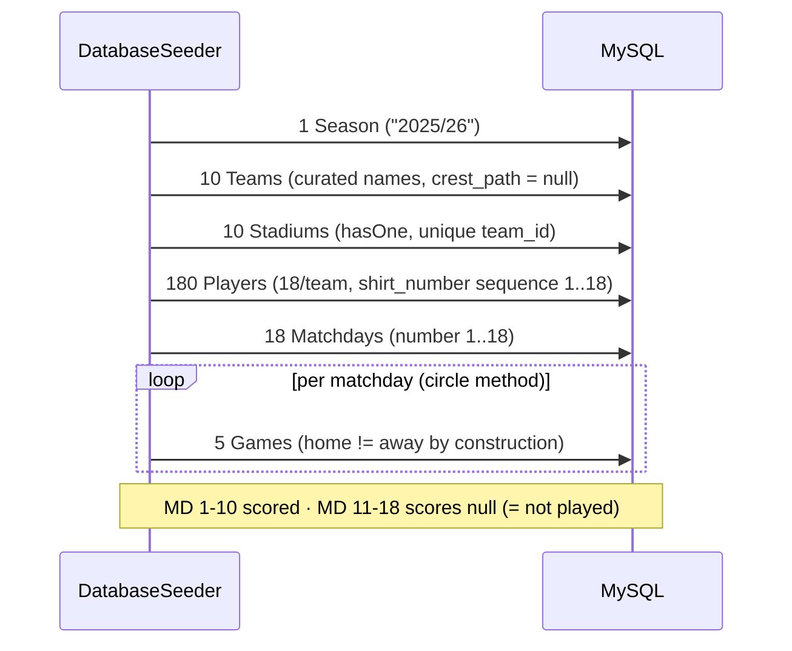
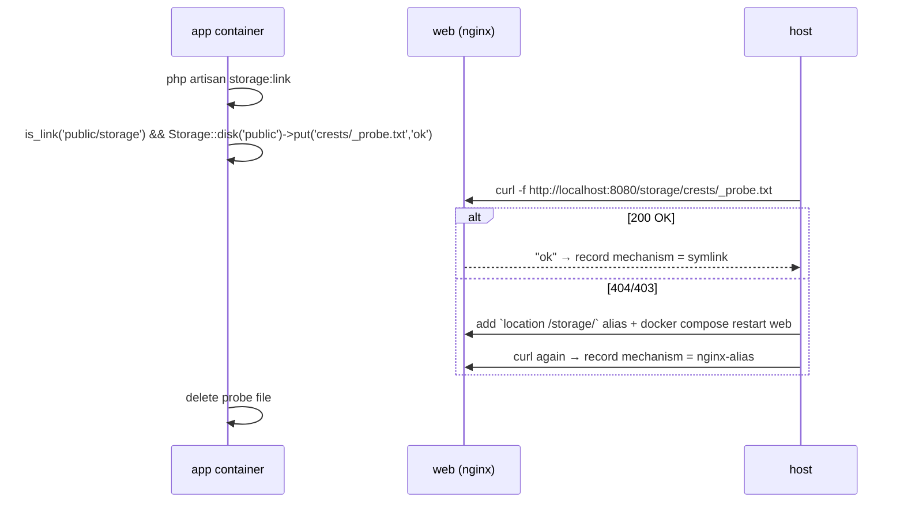

# Design: Fase 2 — Modelo de datos

## Technical Approach

Six migrations create the domain schema exactly as tabled in `exploration.md` (source of truth for columns). Six Eloquent models mirror the attribute convention already in `app/Models/User.php` (`#[Fillable]` + `casts()` method). Integrity lives at two levels: **DB-level** FKs/uniques for structure, **model-level** guard for `home_team_id <> away_team_id`. Business logic (standings) stays out of models per `config.yaml` — the guard is an *entity invariant*, not business logic. Storage serving is dual-path: try the vanilla symlink, fall back to a pre-committed nginx alias.

## Architecture Decisions

### D1 — FK delete strategy

| Relation | Behavior | Rationale |
|---|---|---|
| Team→Season, Player→Team, Stadium→Team, Matchday→Season, Game→Matchday | `cascadeOnDelete()` | Single exclusive owner; child is meaningless alone. |
| `Game.home_team_id`, `Game.away_team_id` | `restrictOnDelete()` | Cascade would silently delete the *opponent's* match history. Rejected. |

Migration order = FK order; `down()` drops in reverse (games → matchdays → players → stadiums → teams → seasons).

### D2 — `home_team_id <> away_team_id`

**Choice**: `Game::booted()` `saving` hook throwing `ValidationException`.
**Rejected**: raw `DB::statement()` CHECK (no Blueprint helper in Laravel 13.x; invisible to SQLite test runs and unrollbackable per-driver); FormRequest-only (bypassed by Filament/tinker/seeders); `DomainException` (surfaces as HTTP 500 — `ValidationException` renders as a 422/field error and gives Fase 3 a free Filament form message).
**Consequence**: a raw SQL insert can still violate the invariant. Accepted — every app write path goes through Eloquent.

### D3 — `WithoutModelEvents` in `DatabaseSeeder` (new finding)

`DatabaseSeeder` already uses `WithoutModelEvents`, which **mutes the D2 guard during seeding**. Keeping the trait (stock, avoids observer side effects); the seeder therefore guarantees distinct teams *by construction* (D6), never by the guard. A test pins this behavior so it is not rediscovered later.

### D4 — Storage serving

**Choice**: attempt `storage:link`; commit the nginx alias block in `docker/nginx/default.conf` as an already-decided contingency; apply records which one actually serves.
**Rationale**: symlink creation from a Linux container onto the NTFS bind mount (`./:/var/www/html`, Docker Desktop/WSL2 `drvfs`) is a documented failure class, and Fase 1 already logged bind-mount friction. **Divergence note**: the alias is *not* how a vanilla Laravel host serves `/storage/` — a future non-Docker deploy must run `storage:link` or replicate the alias, or `/storage/...` 404s silently.

### D5 — Test DB divergence

Tests run SQLite `:memory:` (`phpunit.xml`); runtime is MySQL 8. `config/database.php` has `foreign_key_constraints => true`, so cascade/restrict **are** enforced in tests. Unsigned int widths and MySQL error text are not — restrict tests assert on `QueryException`, never on driver message strings.

### D6 — Fixture generation

**Choice**: circle-method double round-robin in the seeder (10 teams → 18 matchdays × 5 games = 90).
**Rejected**: random pairings (duplicate/self fixtures), hardcoded array (90 unmaintainable rows).

## Data Flow

### Seeding (FK order)



Team names anchor on the Fase-5 mockup division A (`Manaos FC`, `Tapajós SC`, `Río Negro CF`, `Amazonas Royals`, `Belém Athletic`, `Madeira City`, `Xingu Rangers`, `Solimões FC`, `Iquitos United`, `Marañón AC`) for project-wide demo consistency. Cities/positions come from curated arrays, not raw Faker.

### Storage verification (apply MUST execute this)



Committed fallback block (longest-prefix match, order-independent):

```nginx
location /storage/ { alias /var/www/html/storage/app/public/; access_log off; }
```

## File Changes

| File | Action | Description |
|---|---|---|
| `database/migrations/*_create_{seasons,teams,players,stadiums,matchdays,games}_table.php` | Create | 6 tables, columns per `exploration.md`, timestamps in filename order |
| `app/Models/{Season,Team,Player,Stadium,Matchday,Game}.php` | Create | Attribute-configured models + relationships |
| `database/factories/{...}Factory.php` | Create | 6 factories; `Player` shirt_number via `Sequence` |
| `database/seeders/DatabaseSeeder.php` | Modify | FK-ordered seed + circle-method fixtures |
| `docker/nginx/default.conf` | Modify | `/storage/` alias fallback |
| `storage/app/public/crests/.gitignore` | Create | Keeps dir tracked + writable by `www-data` |
| `tests/Feature/{Schema,Relationship,Integrity,Seeder,Factory}*Test.php` | Create | PHPUnit only (Pest not installed) |

## Interfaces / Contracts

Model exemplar (all six follow this shape; `#[Hidden]` is **omitted** — no domain model has secret attributes, unlike `User`):

```php
#[Fillable(['season_id', 'name', 'short_name', 'crest_path', 'founded_year'])]
class Team extends Model
{
    /** @use HasFactory<TeamFactory> */
    use HasFactory;

    protected function casts(): array
    {
        return ['founded_year' => 'integer'];
    }

    public function season(): BelongsTo { return $this->belongsTo(Season::class); }
    public function players(): HasMany { return $this->hasMany(Player::class); }
    public function stadium(): HasOne { return $this->hasOne(Stadium::class); }
    public function homeGames(): HasMany { return $this->hasMany(Game::class, 'home_team_id'); }
    public function awayGames(): HasMany { return $this->hasMany(Game::class, 'away_team_id'); }
}
```

### Relationship wiring

| Model | Relationships | `casts()` |
|---|---|---|
| `Season` | `teams(): HasMany`, `matchdays(): HasMany` | `start_date`, `end_date` → `date` |
| `Team` | `season(): BelongsTo`, `players(): HasMany`, `stadium(): HasOne`, `homeGames`/`awayGames(): HasMany` (explicit FK) | `founded_year` → `integer` |
| `Player` | `team(): BelongsTo` | `birth_date` → `date`, `shirt_number` → `integer` |
| `Stadium` | `team(): BelongsTo` | `capacity` → `integer` |
| `Matchday` | `season(): BelongsTo`, `games(): HasMany` | `date` → `date`, `number` → `integer` |
| `Game` | `matchday(): BelongsTo`, `homeTeam`/`awayTeam(): BelongsTo` (explicit FK) | `kickoff_at` → `datetime`, `home_score`/`away_score` → `integer` |

`Matchday.date` is a nominal label; `Game.kickoff_at` is the authoritative time.

### Game guard (int-cast comparison is load-bearing — form input arrives as strings)

```php
protected static function booted(): void
{
    static::saving(function (Game $game): void {
        if ($game->away_team_id !== null && (int) $game->home_team_id === (int) $game->away_team_id) {
            throw ValidationException::withMessages([
                'away_team_id' => 'A team cannot play against itself.',
            ]);
        }
    });
}
```

## Testing Strategy

`strict_tdd: true` — each row is one RED → GREEN → REFACTOR cycle; the RED assertion must fail before the migration/model exists.

| # | Layer | RED (write first, must fail) | GREEN (minimum) |
|---|---|---|---|
| 1 | Integration | `Schema::hasColumns()` per table | 6 migrations |
| 2 | Integration | Duplicate insert on each composite unique throws `QueryException` (`(season_id,name)`, `(team_id,shirt_number)`, `(season_id,number)`, `stadiums.team_id`) | unique indexes |
| 3 | Integration | Delete Season → its Teams/Matchdays gone (cascade) | `cascadeOnDelete()` |
| 4 | Integration | Delete a Team referenced by a Game throws `QueryException` (restrict) | `restrictOnDelete()` |
| 5 | Unit | Each relationship resolves both directions from factories | model relationship methods |
| 6 | Unit | `Game::create()` with `home_team_id === away_team_id` throws `ValidationException`; string ids `'3'/'3'` also rejected | `booted()` guard |
| 7 | Unit | Guard pins D3: inside `Model::withoutEvents()` the same save is **not** blocked | documents seeder behavior |
| 8 | Integration | `Player` factory ×18 for one team produces 18 distinct shirt numbers | `Sequence` state |
| 9 | Integration | `db:seed` → 1/10/10/180/18/90 row counts, MD11+ scores null, no game with equal teams, all `crest_path` null | seeder |

All tests use `RefreshDatabase`. Storage serving (D4) is verified manually via the sequence above — not automatable in SQLite/PHPUnit.

## Migration / Rollout

No data migration — the schema is new and empty. Apply order: migrations → models → factories → seeder → nginx/storage. Rollback per `proposal.md` (`migrate:rollback`, revert seeder, drop the nginx block + `docker compose restart web`).

## Open Questions

- [ ] Apply MUST record the resolved storage mechanism (symlink vs nginx-alias) in `tasks.md`/verify — it is an input to any future deploy doc.
- [ ] Friendly UI error for `restrictOnDelete()` on Team is deferred to Fase 3 (`TeamResource`) — non-blocking here.

## Future-Proofing Check

Reviewed against known upcoming work (divisions, per-match player stats, News —
all deferred to later Fases per prior decisions) to confirm this schema doesn't
force a destructive migration when they land:

- **Divisions**: addable later as a nullable `teams.division` column (or a
  `divisions` table if it grows more complex). Purely additive — `season_id`
  stays the FK, no restructure needed.
- **Player match-level stats (goals/assists)**: addable later as a new table
  referencing `games.id`/`players.id`. No change to the six tables here.
- **News/Article**: unrelated entity, zero coupling to this schema.

**One accepted watch-item, not solved here**: the `home_team_id <> away_team_id`
guard (D2) lives at the Eloquent level only. It holds today because every
write path goes through Eloquent (Filament forms, seeders, tinker). If a
future feature writes games another way — e.g. a CSV fixture importer using
bulk `DB::table()->insert()`, or an external API sync — that path would
silently bypass the guard. Not worth a raw SQL CHECK constraint today (no
Blueprint helper in Laravel 13.x, breaks SQLite/MySQL test parity per D5) but
flagged here so it's a deliberate re-evaluation, not a rediscovered bug, if
such a feature is ever proposed.
